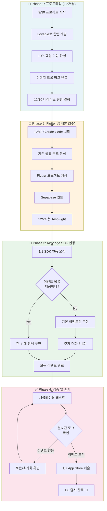
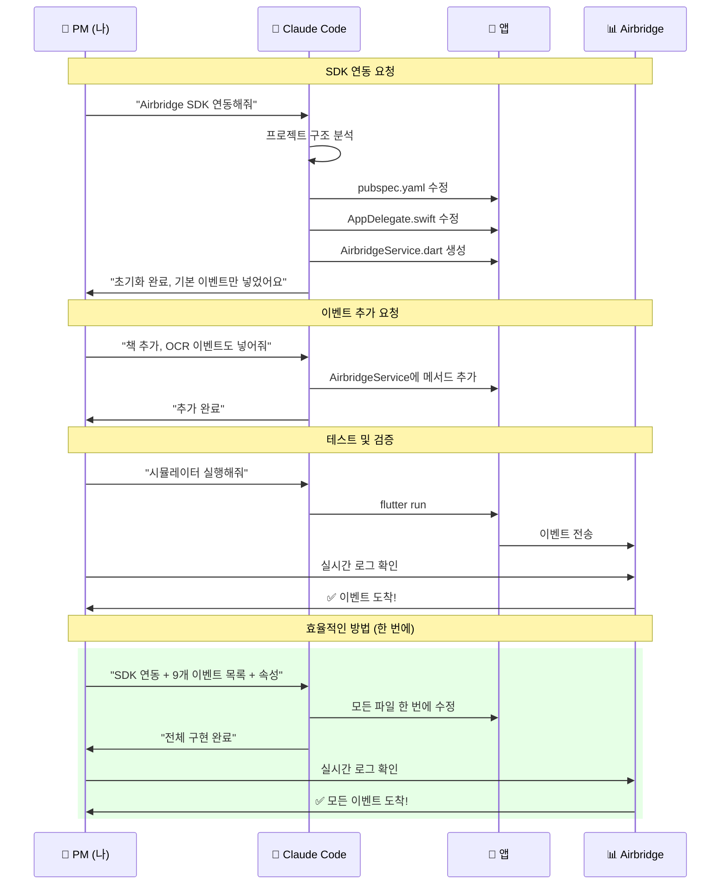

# Airbridge PM의 개밥먹기 일지

## 바이브코딩으로 iOS 앱 만들고, 직접 Airbridge 붙여보기

> 💡 **105일간의 실제 여정**
>
> 코딩 경험 없이 AI와 대화만으로 앱을 만들어 App Store에 출시하고,
> 직접 Airbridge SDK를 연동해 이벤트 트래킹까지 경험한 이야기

<br/>

---

# 📌 TL;DR - 전체 플로우 요약

## SDK 연동 완료까지의 여정 (Mermaid)



<br/>

## AI와의 대화 흐름 (상세)



<br/>

---

# 🎯 왜 이 프로젝트를 시작했나?

## 개밥먹기(Dogfooding)의 필요성

> 🎯 **"우리가 만드는 SDK를 직접 써봐야 고객의 어려움을 알 수 있다"**

매일 고객사에 Airbridge 연동을 안내하지만, 정작 직접 앱을 만들어 연동해본 적은 없었습니다.

- [ ]  연동 가이드 문서가 정말 쉬운지?
- [ ]  이벤트가 제대로 올라오는지 확인하는 과정이 직관적인지?
- [ ]  실시간 로그에서 내 이벤트가 잘 보이는지?

**→ 직접 앱을 만들어서 Airbridge를 붙여보자!**

<br/>

## 만들 앱: BookScribe

| 문제 | 기존 방법 | 한계 |
| --- | --- | --- |
| 책에서 좋은 문장 발견 | 손으로 타이핑 | 귀찮음 |
|  | 하이라이트만 | 나중에 못 찾음 |
|  | 사진만 찍기 | 텍스트 검색 안 됨 |

> ✅ **해결:** 책 사진 → OCR → 자동 텍스트 추출 → 나만의 독서 노트

<br/>

---

# 📱 핵심 기능

| 기능 | 설명 | Airbridge 이벤트 |
|------|------|-----------------|
| 회원가입/로그인 | Apple, Google, 이메일 | `sign_up`, `sign_in` |
| 책 검색/등록 | 알라딘 API 연동 | `search_results_viewed`, `book_added` |
| 문장 수집 | 카메라 → OCR → 저장 | `note_created`, `ocr_used` |
| 온보딩 | 독서 목표 설정 | `complete_tutorial` |
| 홈 화면 | 내 서재 조회 | `home_viewed` |

<br/>

---

# 🛠 기술 스택

| 영역 | 기술 | 용도 |
| --- | --- | --- |
| **📱 프론트엔드** | Flutter / Dart | iOS, Android 동시 개발 |
|  | Riverpod | 상태 관리 |
|  | go_router | 화면 이동 |
| **☁️ 백엔드** | Supabase Database | PostgreSQL |
|  | Supabase Auth | 인증 |
|  | Supabase Edge Functions | API 프록시 |
|  | Supabase Storage | 이미지 저장 |
| **🔌 외부 API** | Google Cloud Vision | OCR |
|  | 알라딘 API | 책 검색 |
|  | **Airbridge SDK** ⭐ | 이벤트 트래킹 |

<br/>

---

# 📅 개발 타임라인

```
Phase 1: 프로토타입 (Lovable)
───────────────────────────────
9/30   🚀 프로젝트 시작
10/5   ✅ 웹앱 핵심 기능 완성
       ... (1.5개월 공백) ...
12/10  📱 Flutter 전환 결정

Phase 2: 네이티브 앱 개발 (Claude Code)
───────────────────────────────
12/18  🔄 Flutter 전환 시작
12/24  🎄 첫 TestFlight 업로드
12/31  😫 Xcode Cloud 4시간 싸움
1/1    🐛 새해 첫날 버그 수정
       📊 Airbridge SDK 연동! ⭐
1/5    ⚠️ 계정 삭제 기능 추가
1/7    ✅ App Store 1.0.0 심사 제출

Phase 3: 운영 및 개선
───────────────────────────────
1/8    🎉 App Store 1.0.0 출시!
1/9    🔧 운영 버그 수정 (카테고리, 캘린더)
1/10   ⭐ 인앱 리뷰 요청 기능
1/11   ✅ 1.0.1 심사 통과
1/12   🐛 메모 수정 UI 버그 발견 및 수정
1/13   📺 AdMob 광고 연동 준비
       ✅ 1.0.2 심사 제출
```

<br/>

---

# 🤖 비개발자의 AI 코딩 완전 가이드

> 💡 **이 섹션은 PM/디자이너가 AI(Claude Code)와 협업할 때 실제로 어떻게 대화하고, 무엇을 얻었는지 구체적으로 정리했습니다.**

<br/>

## CASE 1: SDK 연동 요청 - 실제 대화 흐름

#### 내가 처음에 한 요청 (비효율적)

```
나: "Airbridge SDK 연동해줘"
```

#### Claude가 실제로 한 작업

```
1. [탐색] pubspec.yaml 파일 읽기
2. [탐색] 프로젝트 구조 파악 (Flutter인지, iOS/Android 설정 확인)
3. [판단] "어떤 이벤트를 트래킹할지 정보가 없네... 일단 기본만 하자"
4. [실행] pubspec.yaml에 airbridge_flutter_sdk 추가
5. [실행] ios/Runner/AppDelegate.swift 수정 (SDK 초기화)
6. [실행] android/.../MainApplication.kt 수정
7. [생성] lib/core/airbridge_service.dart (기본 이벤트만)
8. [완료] "SDK 초기화 완료했습니다. 이벤트는 기본만 넣었어요."
```

**결과:** SDK는 붙었지만, 이벤트가 sign_up, sign_in만 있음
**추가 대화 필요:** "책 추가 이벤트도 넣어줘", "OCR 사용 이벤트도 필요해"

---

#### 더 효율적인 요청 방법

```
나: "Airbridge SDK를 연동하고 싶어.

[앱 정보]
- Flutter 앱 (iOS, Android 둘 다)
- 앱 이름: bookscribe
- 토큰: 810a3aa6d6734067a5eaa77c7fd84861

[트래킹할 이벤트 목록]
1. 회원가입 (sign_up) - 방법: apple, google, email
2. 로그인 (sign_in) - 방법: apple, google, email
3. 로그아웃 (sign_out)
4. 책 추가 (book_added) - 속성: 책 제목, ISBN, 저자
5. 노트 생성 (note_created) - 속성: 책 ID, OCR 사용 여부
6. OCR 사용 (ocr_used) - 속성: 성공 여부
7. 온보딩 완료 (complete_tutorial) - 속성: 목표, 독서 빈도
8. 홈 화면 조회 (home_viewed)
9. 책 검색 (search_results_viewed) - 속성: 검색어

[요청사항]
- AirbridgeService라는 별도 클래스로 만들어줘
- 각 이벤트는 static 메서드로
- 딥링크 처리도 포함해줘"
```

#### Claude가 실제로 한 작업 (한 번에 완료)

```
1. [이해] 모든 요구사항 파악 완료
2. [실행] pubspec.yaml 수정
3. [실행] AppDelegate.swift - 초기화 + 딥링크 처리
4. [실행] MainApplication.kt - 초기화
5. [생성] AirbridgeService.dart - 9개 이벤트 전부 구현
6. [완료] "모든 이벤트 구현 완료. 각 화면에서 호출하면 됩니다."
```

**결과:** 추가 대화 없이 한 번에 완료

---

#### 프롬프트 작성 템플릿 (SDK 연동용)

```markdown
[SDK 이름] 연동해줘.

**앱 정보**
- 플랫폼: (Flutter / React Native / iOS / Android)
- 앱 이름:
- 토큰/API Key:

**트래킹할 이벤트**
| 이벤트명 | 카테고리 | 속성 |
|---------|---------|------|
| 회원가입 | sign_up | method (apple/google/email) |
| 구매완료 | purchase | product_id, price, currency |
| ... | ... | ... |

**추가 요청**
- (서비스 클래스 분리 여부)
- (딥링크 처리 여부)
- (특정 코드 스타일)
```

---

### CASE 2: 이벤트 스키마 설계 - 실제 대화 흐름

#### 상황: 어떤 이벤트를 트래킹해야 할지 모를 때

```
나: "우리 앱에서 어떤 이벤트를 트래킹해야 할까?"
```

#### Claude의 사고 과정

```
1. [분석] 앱의 핵심 기능 파악
   - 책 검색/등록
   - OCR로 문장 추출
   - 노트 저장
   - 카테고리 관리

2. [판단] 퍼널 분석에 필요한 이벤트
   - 유입 → 가입 → 핵심 기능 사용 → 리텐션

3. [제안] 이벤트 목록
```

#### Claude의 실제 응답

```
BookScribe 앱의 이벤트 스키마를 제안합니다:

**1. 인증 퍼널**
| 단계 | 이벤트 | 속성 | 분석 목적 |
|------|--------|------|----------|
| 앱 실행 | app_opened | - | DAU 측정 |
| 온보딩 | complete_tutorial | goals, frequency | 온보딩 완료율 |
| 가입 | sign_up | method | 가입 전환율, 선호 방식 |
| 로그인 | sign_in | method | 재방문율 |

**2. 핵심 기능 퍼널**
| 단계 | 이벤트 | 속성 | 분석 목적 |
|------|--------|------|----------|
| 책 검색 | search_results_viewed | query | 검색 사용률 |
| 책 추가 | book_added | title, isbn | 서재 활성화율 |
| OCR 시도 | ocr_used | success | OCR 성공률 |
| 노트 저장 | note_created | book_id, used_ocr | 핵심 가치 도달률 |

**3. 권장 분석 질문**
- "가입 후 첫 책을 추가하는 비율은?"
- "OCR 실패 후 이탈률은?"
- "어떤 온보딩 목표를 선택한 사용자가 리텐션이 높은가?"

이 스키마로 진행할까요?
```

---

#### 더 정교한 스키마를 위한 프롬프트

```
나: "이벤트 스키마를 설계해줘.

[비즈니스 목표]
- 신규 가입 후 7일 내 노트 3개 이상 작성 유도
- OCR 기능이 핵심 가치이므로 OCR 성공률 최적화
- 유료 전환을 위한 퍼널 분석 (추후)

[분석하고 싶은 질문]
1. 어떤 가입 방식이 리텐션이 높은가?
2. OCR 실패 시 사용자가 어떻게 행동하는가?
3. 파워 유저의 특징은? (책 몇 권, 노트 몇 개)

[현재 앱 화면 흐름]
온보딩 → 홈 → 책 검색 → 책 상세 → OCR 촬영 → 노트 저장

[추가 고려사항]
- Airbridge 표준 이벤트(semanticAttributes)를 최대한 활용
- 커스텀 속성은 꼭 필요한 것만
- 나중에 리마케팅 세그먼트로 활용 가능하게"
```

#### Claude의 심화 응답

```
비즈니스 목표 기반 이벤트 스키마:

**Tier 1: 필수 이벤트 (리텐션 분석용)**
| 이벤트 | Airbridge 표준 | 커스텀 속성 | 세그먼트 활용 |
|--------|---------------|------------|--------------|
| sign_up | ✅ SIGN_UP | method | "Apple 가입자" |
| note_created | ❌ 커스텀 | book_id, used_ocr, note_count | "노트 3개 이상" |

**Tier 2: 퍼널 분석용**
| 이벤트 | 퍼널 단계 | 이탈 분석 |
|--------|----------|----------|
| home_viewed | 1단계 | 홈 → 검색 이탈 |
| search_results_viewed | 2단계 | 검색 → 책 추가 이탈 |
| book_added | 3단계 | 책 추가 → OCR 이탈 |
| ocr_used | 4단계 | OCR 성공/실패 분기 |
| note_created | 5단계 | 최종 전환 |

**Tier 3: OCR 최적화용**
| 이벤트 | 속성 | 분석 |
|--------|------|------|
| ocr_used | success: true/false | 성공률 |
| ocr_used | retry_count | 재시도 패턴 |
| ocr_used | image_source: camera/gallery | 입력 방식별 성공률 |

**리마케팅 세그먼트 예시**
- "가입 후 7일, 노트 0개" → 푸시: "첫 문장을 기록해보세요"
- "OCR 실패 2회 이상" → 인앱 메시지: "이렇게 찍으면 인식률이 올라가요"
```

---

### CASE 3: 버그 수정 요청 - 효율적인 리포트 방법

#### 비효율적인 요청

```
나: "버그 있어. 저장이 안 돼"
```

Claude: "어떤 화면에서요? 어떤 저장이요? 에러 메시지 있나요?"
→ **3~4번의 추가 대화 필요**

---

#### 효율적인 버그 리포트 템플릿

```
나: "버그 수정해줘.

[증상]
노트 상세 화면에서 메모 수정 버튼을 누르면 저장 버튼이 안 보임

[재현 경로]
홈 → 최근 노트 클릭 → 노트 상세 → 메모 "수정" 버튼 클릭

[기대 동작]
TextField + 저장 버튼이 나타나야 함

[실제 동작]
TextField만 나오고 저장 버튼 없음. 스크롤 해도 안 보임.

[에러 로그] (있다면)
BoxConstraints forces an infinite width.
ElevatedButton:file:///.../note_detail_screen.dart:436:19

[스크린샷]
(있다면 첨부)"
```

#### Claude의 작업 흐름

```
1. [파일 특정] note_detail_screen.dart:436 확인
2. [원인 분석] Row 안에 ElevatedButton이 있는데
              SingleChildScrollView에서 너비 제약 없음
3. [해결 방안] SizedBox(width: double.infinity)로 감싸기
4. [수정 실행] 코드 변경
5. [검증 요청] "시뮬레이터에서 확인해보세요"
```

**결과:** 한 번의 대화로 해결

---

### CASE 4: 의사결정이 필요할 때

#### 상황: 두 가지 방식 중 선택해야 할 때

```
나: "OCR 기능을 어떻게 구현하는 게 좋을까?"
```

#### Claude의 응답 패턴

```
OCR 구현 방식 비교:

**옵션 A: 온디바이스 (ML Kit)**
- 장점: 무료, 오프라인 가능, 빠름
- 단점: 한글 인식률 낮음 (약 70%)
- 추천 상황: 비용 민감, 영어 위주

**옵션 B: 클라우드 (Google Vision API)**
- 장점: 높은 정확도 (95%+), 다국어
- 단점: 유료 (1,000건당 $1.5), 네트워크 필요
- 추천 상황: 품질 중요, 한글 위주

**옵션 C: 하이브리드** ← 추천
- ML Kit 먼저 시도 → 신뢰도 낮으면 Cloud API
- 장점: 비용 절감 + 품질 보장
- 단점: 구현 복잡도 증가

👉 추천: 옵션 C (하이브리드)
이유: 대부분의 경우 무료로 처리하면서, 한글처럼 어려운 케이스만
유료 API 사용. 월 1만 건 기준 약 $5 예상.

어떤 옵션으로 할까요?
```

```
나: "C로 해줘"
```

→ Claude가 바로 구현 시작

---

### CASE 5: 프로젝트 컨텍스트 전달 (CLAUDE.md)

#### 매번 설명하는 비효율

```
대화 1: "이 앱은 Flutter로 만든 독서 노트 앱이고..."
대화 2: "아까 말했듯이 Riverpod 쓰고 있고..."
대화 3: "Supabase 백엔드인데..."
```

#### 해결책: CLAUDE.md 파일 작성

프로젝트 루트에 `CLAUDE.md` 파일을 만들면 Claude가 자동으로 읽음:

```markdown
# 프로젝트 가이드

## 기술 스택
- Flutter 3.10+ / Dart
- Supabase (Auth, Database, Storage)
- Riverpod (상태 관리)
- go_router (라우팅)

## 폴더 구조
- lib/screens: 화면 위젯
- lib/providers: Riverpod providers
- lib/services: API 호출
- lib/models: 데이터 모델

## 코딩 규칙
- 한국어 주석 사용
- const 생성자 적극 사용
- 에러는 SnackBar로 표시

## 현재 이슈
- OCR 한글 인식률 개선 필요
- 다크모드 일부 화면 미적용
```

**효과:**
- 매번 설명 안 해도 됨
- 일관된 코드 스타일 유지
- "OCR 개선해줘"만 해도 맥락 이해

---

### 프롬프트 효율성 비교표

| 요청 유형 | 비효율적 | 효율적 | 절약 시간 |
|----------|---------|--------|----------|
| SDK 연동 | "SDK 붙여줘" | 이벤트 목록 + 속성 포함 | 3~4회 대화 → 1회 |
| 버그 수정 | "안 돼" | 증상 + 재현 경로 + 로그 | 2~3회 → 1회 |
| 기능 추가 | "기능 추가해줘" | 상세 요구사항 + 예외 처리 | 5회+ → 2회 |
| 스키마 설계 | "이벤트 뭐 넣어?" | 비즈니스 목표 + 분석 질문 | 4회 → 1회 |

---

### 비개발자가 알아야 할 최소 지식

| 알아야 하는 것 | 몰라도 되는 것 |
|--------------|--------------|
| 앱이 뭘 해야 하는지 (요구사항) | 코드 문법 |
| 에러가 발생했다는 사실 + 로그 | 에러 원인 |
| 화면이 어때야 하는지 (UI/UX) | CSS, 레이아웃 코드 |
| 어떤 이벤트를 추적할지 (비즈니스 관점) | SDK 내부 동작 |
| 테스트 결과 (됐다/안됐다) | 테스트 코드 작성법 |
| 원하는 결과물의 구체적 모습 | 구현 방법 |

<br/>

---

# 🎯 Airbridge 온보딩에 적용할 인사이트

## Zero-Friction 온보딩을 위한 핵심 발견

#### 발견 1: "시작이 반이다" - 첫 5분의 경험

내가 겪은 것:
```
Airbridge 문서 열기 → Flutter SDK 찾기 → 설치 명령어 복사
→ pubspec.yaml 열기 → 붙여넣기 → flutter pub get
→ 초기화 코드 찾기 → AppDelegate.swift 열기 → 코드 복사
→ 어디에 붙여야 하지...? → 문서 다시 읽기
```

**마찰 포인트:**
- 문서에서 "어디에" 코드를 넣어야 하는지 찾는 시간
- 예시 코드가 추상적이라 내 앱에 맞게 수정 필요
- 초기화가 잘 됐는지 확인하는 방법 불명확

#### 발견 2: "내가 한 질문 = 고객도 할 질문"

| 내가 한 질문 | 고객도 할 질문 | 문서에서 찾기 어려웠던 점 |
|------------|--------------|----------------------|
| "AppDelegate 어디에 코드 넣어?" | 같음 | 파일 경로만 있고 정확한 위치 없음 |
| "토큰 어디서 복사해?" | 같음 | 대시보드 스크린샷 없음 |
| "시뮬레이터에서 테스트 돼?" | 같음 | 명시적 언급 없음 |
| "이벤트 올라갔는지 어떻게 알아?" | 같음 | 실시간 로그 위치 설명 부족 |
| "semanticAttributes가 뭐야?" | 같음 | 용어 설명 없이 바로 사용 |

---

### 온보딩 개선 제안 (구체적 액션 아이템)

#### 1. "5분 퀵스타트" 페이지 신설

**현재:** 문서가 포괄적이라 처음 시작하는 사람이 헤맴

**개선안:**

```
┌─────────────────────────────────────────────────────┐
│  🚀 5분 퀵스타트 (Flutter)                          │
├─────────────────────────────────────────────────────┤
│                                                     │
│  Step 1: SDK 설치 (1분)                            │
│  ┌─────────────────────────────────────────────┐   │
│  │ flutter pub add airbridge_flutter_sdk       │ 📋│
│  └─────────────────────────────────────────────┘   │
│  ✅ pubspec.yaml에 추가됨                          │
│                                                     │
│  Step 2: iOS 초기화 (2분)                          │
│  📁 ios/Runner/AppDelegate.swift 열기              │
│  ┌─────────────────────────────────────────────┐   │
│  │ import airbridge_flutter_sdk                │   │
│  │                                             │   │
│  │ // didFinishLaunchingWithOptions 안에 추가  │   │
│  │ AirbridgeFlutter.initializeSDK(             │   │
│  │   name: "내앱이름",     // ← 수정           │   │
│  │   token: "내토큰"       // ← 대시보드에서 복사│   │
│  │ )                                           │ 📋│
│  └─────────────────────────────────────────────┘   │
│  💡 토큰 위치: 대시보드 → 설정 → 앱 정보 [링크]     │
│                                                     │
│  Step 3: 테스트 (2분)                              │
│  앱 실행 → 대시보드 "실시간 로그" 확인 [링크]       │
│  ┌─────────────────────────────────────────────┐   │
│  │ ✅ app_opened 이벤트가 보이면 성공!         │   │
│  └─────────────────────────────────────────────┘   │
│                                                     │
│  🎉 완료! 다음 단계: 이벤트 트래킹 추가하기 →      │
│                                                     │
└─────────────────────────────────────────────────────┘
```

#### 2. "복붙 가능한" 실전 예시 코드

**현재:**
```dart
Airbridge.trackEvent(category: "...", semanticAttributes: {...})
```

**개선안:**
```dart
// ✅ 회원가입 완료 (Apple 로그인)
// 위치: 회원가입 성공 콜백에서 호출
Airbridge.trackEvent(
  category: AirbridgeCategory.SIGN_UP,
  semanticAttributes: {
    AirbridgeAttribute.ACTION: 'apple',  // 'google', 'email' 등
  },
);

// ✅ 상품 구매 완료 (이커머스)
// 위치: 결제 완료 화면에서 호출
Airbridge.trackEvent(
  category: AirbridgeCategory.ORDER_COMPLETED,
  semanticAttributes: {
    AirbridgeAttribute.TRANSACTION_ID: 'ORDER_12345',
    AirbridgeAttribute.CURRENCY: 'KRW',
    AirbridgeAttribute.TOTAL_VALUE: 29000,
    AirbridgeAttribute.PRODUCTS: [
      AirbridgeProduct()
        ..setId('SKU_001')
        ..setName('프리미엄 구독권')
        ..setPrice(29000)
        ..setQuantity(1),
    ],
  },
);

// ✅ 커스텀 이벤트 (콘텐츠 앱)
// 위치: 콘텐츠 조회 화면에서 호출
Airbridge.trackEvent(
  category: 'content_viewed',  // 커스텀 카테고리
  semanticAttributes: {
    AirbridgeAttribute.LABEL: '인기 에피소드 10화',
  },
  customAttributes: {
    'content_id': 'EP_010',
    'content_type': 'video',
    'duration_seconds': 1200,
  },
);
```

#### 3. "트러블슈팅 플로우차트" 추가

```
이벤트가 안 올라와요
        │
        ▼
┌───────────────────┐
│ 앱이 크래시 나나요? │
└───────────────────┘
    │Yes      │No
    ▼         ▼
초기화 코드   ┌───────────────────┐
확인        │ 실시간 로그 페이지   │
           │ 열어봤나요?         │
           └───────────────────┘
               │Yes      │No
               ▼         ▼
        ┌──────────┐   [링크로 안내]
        │ 필터 확인 │
        │ (시간대) │
        └──────────┘
               │
               ▼
        ┌──────────────────┐
        │ 토큰이 맞나요?     │
        │ 대시보드에서 재복사 │
        └──────────────────┘
               │
               ▼
        [그래도 안 되면 CS 문의]
```

#### 4. "AI 시대 연동 가이드" 신설

> 💡 **Claude/ChatGPT로 5분 만에 연동하기**
>
> 아래 프롬프트를 AI에게 복사해서 붙여넣으세요:
>
> ```
> Airbridge Flutter SDK를 연동해줘.
>
> [앱 정보]
> - 앱 이름: (대시보드에서 확인)
> - 토큰: (대시보드 → 설정 → 앱 정보에서 복사)
>
> [트래킹할 이벤트]
> - 회원가입 (sign_up): 가입 방식 (apple/google/email)
> - 로그인 (sign_in): 로그인 방식
> - 구매 (order_completed): 상품 정보, 금액
>
> [요청사항]
> - Airbridge 공식 Flutter SDK 문서 참고
> - iOS, Android 초기화 코드 포함
> - 이벤트별 예시 코드 작성
> ```
>
> AI가 코드를 작성해주면:
> 1. 해당 파일에 복사-붙여넣기
> 2. 앱 실행
> 3. Airbridge 실시간 로그에서 이벤트 확인
>
> ⚠️ 토큰은 절대 공개 저장소에 커밋하지 마세요!

#### 5. 용어 사전 (비개발자용)

| 용어 | 한 줄 설명 | 예시 |
|-----|----------|------|
| SDK | 앱에 추가하는 도구 패키지 | "Airbridge SDK를 앱에 설치한다" |
| 초기화 | 앱 시작할 때 SDK 준비시키기 | "앱이 켜지면 Airbridge 연결" |
| 이벤트 | 사용자가 한 행동 기록 | "회원가입 완료", "구매 완료" |
| 트래킹 | 이벤트를 서버로 전송하기 | "구매 이벤트를 트래킹한다" |
| semanticAttributes | Airbridge 표준 속성 | 금액, 상품명 등 공통 속성 |
| customAttributes | 우리 앱만의 속성 | 책 제목, 에피소드 번호 등 |
| 딥링크 | 앱 특정 화면으로 바로 가는 링크 | "이 링크 누르면 상품 페이지로" |
| 퍼널 | 사용자 행동 단계 | 홈 → 검색 → 상품 → 구매 |
| 어트리뷰션 | 어디서 유입됐는지 추적 | "이 사용자는 인스타 광고로 왔다" |

---

### 내부 제안 사항 (액션 아이템)

#### 🔴 즉시 (이번 분기)

| 제안 | 담당 | 예상 효과 |
|-----|-----|----------|
| 5분 퀵스타트 페이지 | Tech Writer | 첫 연동 시간 50% 단축 |
| 복붙 가능한 코드 예시 추가 | SDK 팀 | CS 문의 30% 감소 예상 |
| 실시간 로그 페이지 개선 | 프론트엔드 | "이벤트 확인" 문의 감소 |

#### 🟡 중기 (다음 분기)

| 제안 | 담당 | 예상 효과 |
|-----|-----|----------|
| AI 연동 가이드 | PM/Tech Writer | 신규 고객 온보딩 간소화 |
| 트러블슈팅 플로우차트 | CS/Tech Writer | Self-serve 해결률 증가 |
| 비개발자 용어 사전 | PM | PM↔개발자 커뮤니케이션 개선 |

#### 🟢 장기 (탐색)

| 제안 | 담당 | 예상 효과 |
|-----|-----|----------|
| "첫 이벤트 도착" 축하 UI | 프론트엔드 | 사용자 경험 개선 |
| 연동 완료 체크리스트 UI | 프론트엔드 | 단계별 진행 시각화 |
| AI 기반 연동 어시스턴트 | AI/백엔드 | 문서 없이 대화로 연동 |

<br/>

---

# 🔌 Airbridge 연동 상세

## 왜 Airbridge를 붙였나?

| 이유 | 설명 |
| --- | --- |
| 🐕 **개밥먹기** | PM으로서 직접 연동 경험 |
| 📊 **실제 데이터** | 내 앱 사용자 행동 분석 |
| 🤝 **신뢰도** | 고객에게 "저도 써봤어요" 말할 수 있음 |

### SDK 초기화 (iOS)

```swift
// ios/Runner/AppDelegate.swift
import airbridge_flutter_sdk

@main
class AppDelegate: FlutterAppDelegate {
  override func application(...) -> Bool {
    AirbridgeFlutter.initializeSDK(
      name: "bookscribe",
      token: "810a3aa6d6734067a5eaa77c7fd84861"
    )
    return super.application(...)
  }
}
```

### 이벤트 트래킹 서비스 (Dart)

```dart
// lib/core/airbridge_service.dart
class AirbridgeService {
  // 회원가입
  static void trackSignUp({required String method}) {
    Airbridge.trackEvent(
      category: AirbridgeCategory.SIGN_UP,
      semanticAttributes: {
        AirbridgeAttribute.ACTION: method, // 'apple', 'google', 'email'
      },
    );
  }

  // 책 추가
  static void trackBookAdded({
    required String bookTitle,
    String? isbn,
    String? author,
  }) {
    Airbridge.trackEvent(
      category: 'book_added',
      semanticAttributes: {
        AirbridgeAttribute.LABEL: bookTitle,
      },
      customAttributes: {
        if (isbn != null) 'isbn': isbn,
        if (author != null) 'author': author,
      },
    );
  }

  // 노트 생성 (OCR 사용 여부 포함)
  static void trackNoteCreated({
    required String bookId,
    required bool usedOcr,
  }) {
    Airbridge.trackEvent(
      category: 'note_created',
      customAttributes: {
        'book_id': bookId,
        'used_ocr': usedOcr,
      },
    );
  }
}
```

### 전체 이벤트 목록

| 이벤트 | 카테고리 | 속성 | 트리거 시점 |
|--------|----------|------|------------|
| 회원가입 | `sign_up` | method (apple/google/email) | 첫 가입 완료 |
| 로그인 | `sign_in` | method | 로그인 성공 |
| 로그아웃 | `sign_out` | - | 로그아웃 버튼 |
| 홈 조회 | `home_viewed` | - | 홈 화면 진입 |
| 책 검색 | `search_results_viewed` | query | 검색 결과 표시 |
| 책 추가 | `book_added` | bookTitle, isbn, author | 서재에 책 추가 |
| 노트 생성 | `note_created` | bookId, usedOcr | 문장 저장 완료 |
| OCR 사용 | `ocr_used` | success | OCR 시도 |
| 온보딩 완료 | `complete_tutorial` | goals, readingFrequency | 온보딩 마지막 단계 |

### 딥링크 처리

```swift
// Universal Links
override func application(..., continue userActivity: NSUserActivity, ...) -> Bool {
  AirbridgeFlutter.trackDeeplink(userActivity: userActivity)
  return true
}

// URL Scheme
override func application(..., open url: URL, ...) -> Bool {
  AirbridgeFlutter.trackDeeplink(url: url)
  return true
}
```

### 실시간 로그 확인 방법

1. Airbridge 대시보드 → 원본 데이터 → 실시간 이벤트 로그
2. 시뮬레이터/실기기에서 앱 실행
3. 이벤트 발생 후 1~2초 내 로그 확인 가능

<br/>

---

# 🐛 겪었던 버그들

## 1. 크리스마스 이브 버그 (12/24)

**iOS 사진 OCR 실패**
- 증상: 갤러리 사진 선택하면 OCR 안 됨
- 원인: iOS는 HEIC 형식, OCR은 JPEG만 지원
- 해결: 이미지 포맷 자동 변환 추가

**백그라운드 복귀 크래시**
- 증상: 앱 잠깐 나갔다 오면 튕김
- 원인: 로그인 세션 만료
- 해결: 앱 복귀 시 세션 자동 갱신

### 2. 새해 첫날 버그 (1/1)

**2026년 캘린더 표시 안됨**
```dart
// 문제의 코드 (하드코딩)
final currentYear = 2025;

// 수정 후
final currentYear = DateTime.now().year;
```
**교훈:** 날짜, 연도는 절대 하드코딩하지 말 것!

### 3. 메모 수정 UI 버그 (1/12)

**증상:** 노트 상세 화면에서 메모 수정 시 저장 버튼이 안 보임

**에러:**
```
BoxConstraints forces an infinite width.
ElevatedButton:file:///.../note_detail_screen.dart:436:19
```

**원인:** `SingleChildScrollView` 내부 `Row`에서 `ElevatedButton`이 무한 너비를 가지려 함

**해결:** 버튼을 `SizedBox(width: double.infinity)`로 감싸서 명시적 너비 지정

```dart
// Before (에러)
Row(children: [TextButton(...), ElevatedButton(...)])

// After (정상)
SizedBox(
  width: double.infinity,
  child: ElevatedButton(onPressed: _saveMemo, child: Text('저장')),
)
```

<br/>

---

# 📺 광고 연동 (AdMob)

## 진행 현황 (1/13)

1. **AdMob 앱 등록** ✅
2. **app-ads.txt 설정** ✅
   - GitHub Pages로 호스팅: `song-yechan.github.io/bookscribe-site`
   - 파일 경로: `/app-ads.txt`
3. **앱 인증** ⏳ (24시간 내 크롤링 예정)

### app-ads.txt 내용

```
google.com, pub-4959092476434874, DIRECT, f08c47fec0942fa0
```

<br/>

---

# 📊 개발 통계

## 기본 수치

| 항목 | 값 |
|------|-----|
| 총 개발 기간 | 105일 (9/30 ~ 1/13) |
| 총 커밋 수 | 158개 |
| Dart 파일 수 | 43개 |
| 코드 라인 수 | 약 10,600줄 |
| 테스트 파일 | 39개 |
| Edge Functions | 4개 |
| 현재 버전 | 1.0.2 (빌드 32) |

### 버전 히스토리

| 버전 | 빌드 | 날짜 | 주요 변경 |
|------|------|------|----------|
| 1.0.0 | 28 | 1/7 | 첫 출시 |
| 1.0.1 | 31 | 1/11 | 운영 버그 수정, 인앱 리뷰 |
| 1.0.2 | 32 | 1/13 | 메모 수정 UI 버그 수정 |

### AI 사용량 (추정)

| 도구 | 기간 | 역할 |
|------|------|------|
| Lovable | 9/30 ~ 12/10 | 웹앱 프로토타입 |
| Claude Code | 12/18 ~ 현재 | Flutter 앱 개발, 배포 |

<br/>

---

# 💡 바이브코딩 인사이트

## ✅ 잘한 것

1. **CLAUDE.md 작성** - AI에게 프로젝트 컨텍스트 제공
2. **하이브리드 OCR** - 무료 ML Kit + 유료 Cloud API
3. **작은 단위 커밋** - 롤백 용이
4. **Airbridge 조기 연동** - 출시 전부터 이벤트 설계

## ❌ 못한 것

1. **App Store 가이드라인 미리 안 읽음** - 계정 삭제 기능 급히 추가
2. **날짜 하드코딩** - 새해 버그
3. **UI 테스트 부족** - 메모 수정 버그 늦게 발견

<br/>

## 💰 비용 (첫 해 기준)

| 항목 | 연 비용 |
|------|--------|
| Claude Pro | $240 |
| Apple Developer | $99 |
| Supabase | $0 (무료 플랜) |
| Google Cloud | $0 (무료 할당량) |
| **합계** | **약 $340** |

<br/>

---

# 🎤 Airbridge PM으로서 느낀 점

## 연동 경험

| 항목 | 평가 | 상세 |
| --- | --- | --- |
| Flutter SDK 문서 | ⭐⭐⭐⭐⭐ | 5분 만에 초기화 완료 |
| 이벤트 설계 | ⭐⭐⭐☆☆ | semanticAttributes vs customAttributes 구분 헷갈림 |
| 실시간 로그 | ⭐⭐⭐⭐⭐ | 이벤트가 바로 올라와서 디버깅 편함 |

## 개선 제안 (내부 피드백)

- [ ]  Flutter 예제 코드에 더 다양한 이벤트 케이스 추가
- [ ]  실시간 로그에서 customAttributes 더 잘 보이게
- [ ]  시뮬레이터 테스트 시 주의사항 문서화

<br/>

---

# 🏁 마치며

## 개밥먹기를 통해 얻은 것

| 얻은 것 | 설명 |
| --- | --- |
| 🤝 **공감** | 고객이 연동할 때 어디서 막히는지 체감 |
| 💪 **자신감** | "저도 직접 해봤어요" 말할 수 있음 |
| 💡 **아이디어** | 문서/대시보드 개선점 발견 |

## 핵심 교훈 4가지

> 1️⃣ **완벽한 코드를 짜려 하지 않기**
>
> 2️⃣ **에러가 나면 AI에게 보여주기**
>
> 3️⃣ **작게 시작해서 점점 키우기**
>
> 4️⃣ **직접 써봐야 진짜 안다**

<br/>

---

# 📝 문서 정보

| 항목 | 값 |
| --- | --- |
| **만든 사람** | Airbridge PM @yechan |
| **최종 수정** | 2026-01-13 |
| **앱 버전** | 1.0.2 (빌드 32) |
| **문서 버전** | 5.0 (노션 최적화 + Mermaid 플로우 추가) |
